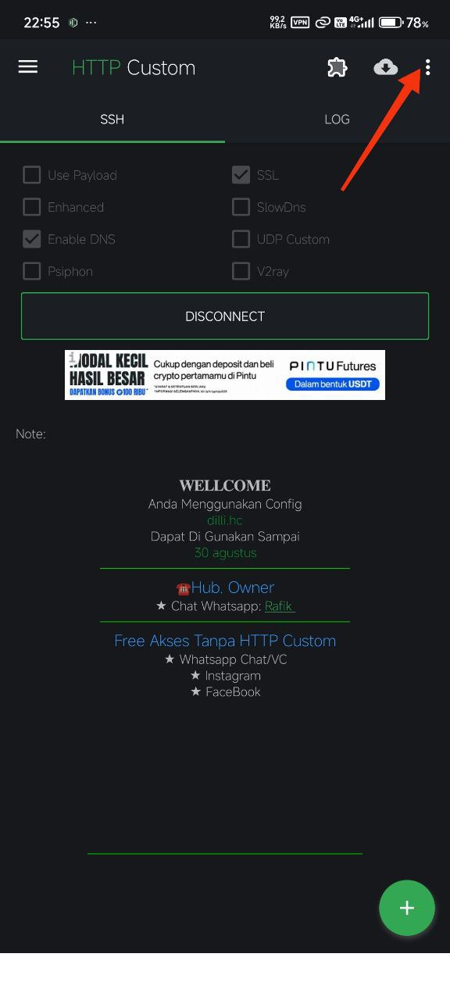
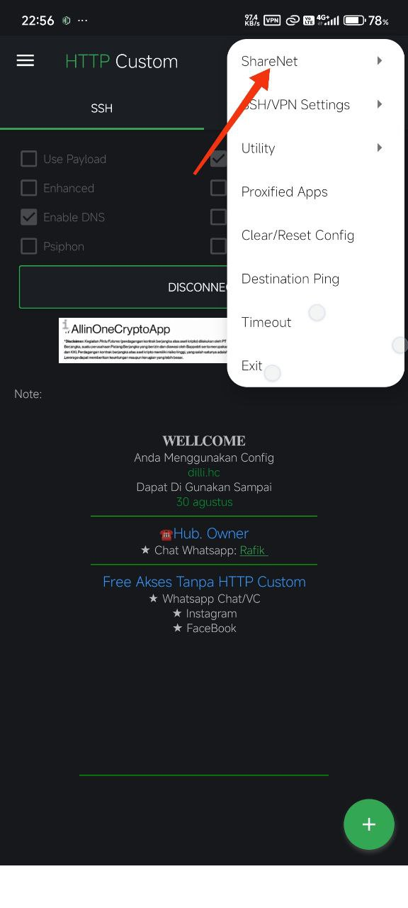
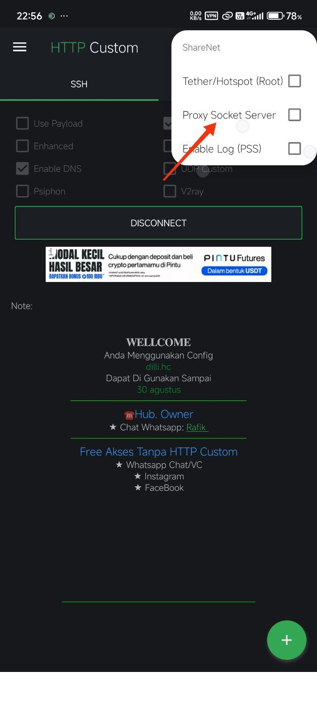
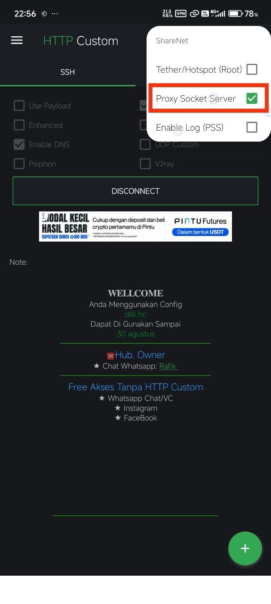
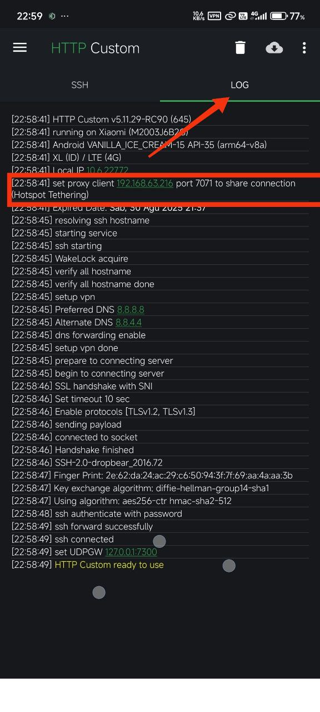

## Setting Hospot SuntikPaket
* Dari android ke android

 1 . Menggunakan dual HTTP Custom dan configurasi file yang sama 
install [HTTP Custom](https://play.google.com/store/apps/details?id=xyz.easypro.httpcustom) di HP yang menghidupkan hospot dan install juga di HP yang menghidupkan wifi,lalu kirim file configurasi yang sama ke masing-masing HP, dan jalankan [HTTP Custom](https://play.google.com/store/apps/details?id=xyz.easypro.httpcustom) di masing-masing HP (ini cara yang paling simple).

  
  2 . Menggunakan pengaturan proxy manual di setelan wifi
 Untuk cara yang ini hanya tersedia di [HTTP Custom](https://play.google.com/store/apps/details?id=xyz.easypro.httpcustom) (tanpa aplikasi yang lain), kalo untuk dark tunnel atau yang lain nya bisa saja tapi menggunakan bantuan aplikasi lain seperti [NetShare](https://play.google.com/store/apps/details?id=kha.prog.mikrotik).  

  Pertama hidupkan data dan hospot dan tekan connect di HTTP Custom di hp utama,lalu tekan titik 3.
  
 

 Setelah itu klik ShareNet
 
  
 
 Dan ceklis proxy socket sever
 
 
 

 Setelah itu kembali kehalaman utama klik di bagian log dan cari set proxy client beserta port nya,dan terkadang proxy ini bisa berubah-ubah apabila kita menghidupkan ulang hospot.

  

 

  
