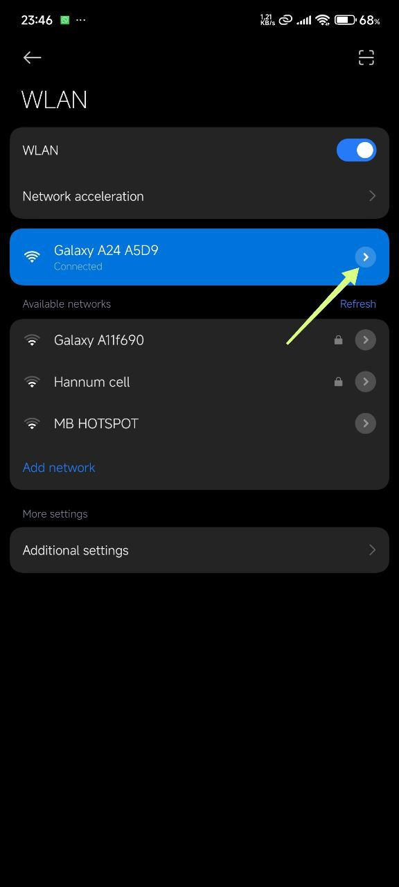
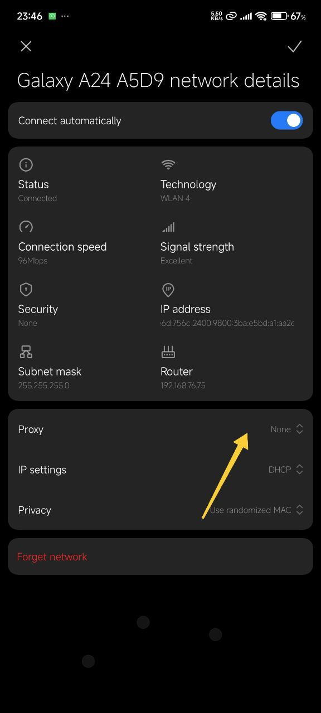
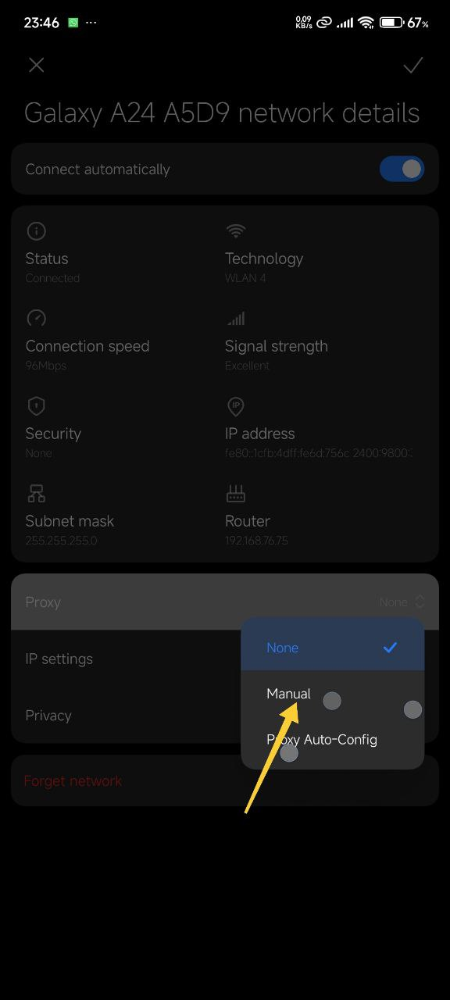
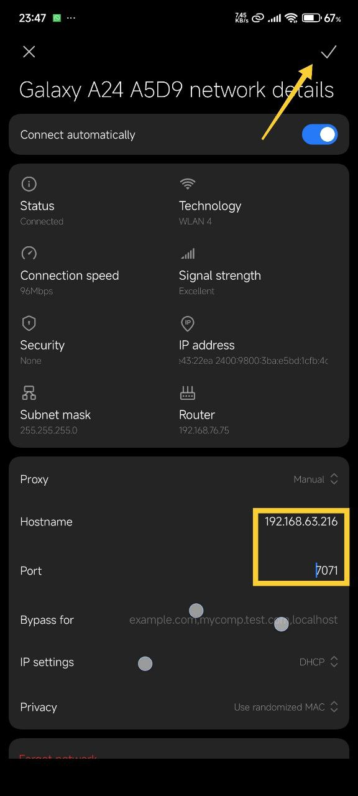
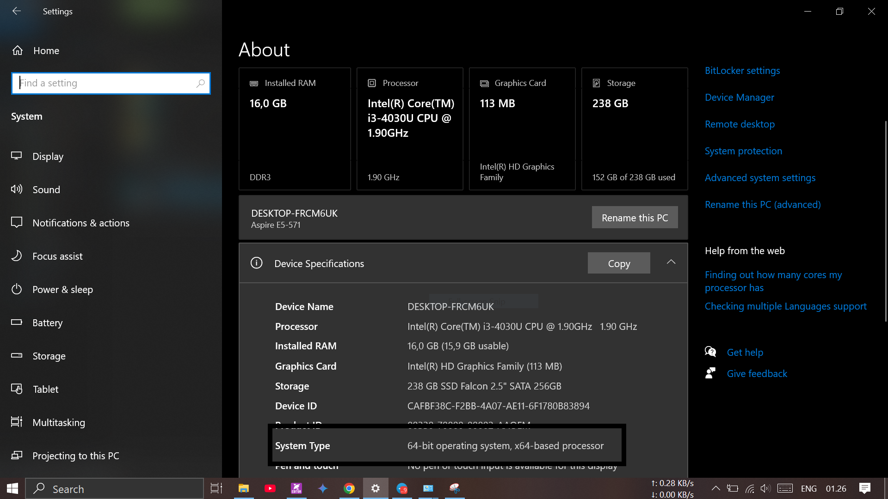
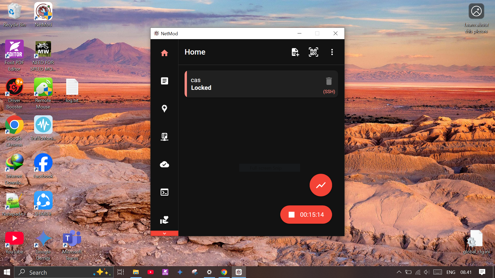

# Setting Hospot SuntikPaket
***
##  Dari android ke android

 ### Cara yang pertama Menggunakan dual HTTP Custom dengan configurasi file yang berbeda 
 
 install [HTTP Custom](https://play.google.com/store/apps/details?id=xyz.easypro.httpcustom) di HP yang menghidupkan hospot dan install juga di HP yang menghidupkan wifi,lalu siapkan konfigurasi file masing-masing HP, dan jalankan [HTTP Custom](https://play.google.com/store/apps/details?id=xyz.easypro.httpcustom) di masing-masing HP (ini cara yang paling simple).
Order file konfigurasi Hospot di [SuntikPaket](https://t.me/SuntikPaket) cuma 5k.

  
  ### Cara yang ke dua Menggunakan pengaturan proxy manual di setelan wifi
 
  Untuk cara yang ini hanya tersedia di [HTTP Custom](https://play.google.com/store/apps/details?id=xyz.easypro.httpcustom) (tanpa aplikasi yang lain), kalo untuk Dark Tunnel atau yang lain nya bisa saja tapi menggunakan bantuan aplikasi lain seperti [NetShare](https://play.google.com/store/apps/details?id=kha.prog.mikrotik), perlu di catat untuk cara yang kedua ini kekurangan nya tidak bisa membuka whatsapp dan telegram di HP yang menghidupkan wifi,tapi kelebihan yang kedua ini cukup satu konfigurasi file.  

  ##
  ####  -Settingan di hp yang menggunakan hospot
 * Pertama hidupkan data dan hospot dan tekan connect di HTTP Custom ,lalu tekan titik 3.
 
 

 * Setelah itu klik ShareNet
 
 
 
 * Dan ceklis Proxy Socket Sever
 

 * Setelah itu kembali kehalaman utama klik di bagian LOG dan cari Set Proxy Client beserta Port nya,dan terkadang proxy ini bisa berubah-ubah apabila kita menghidupkan ulang hospot.

 
 
 ##

#### -Settingan di hp yang menghidupkan wifi
 * Pertama hidupkan wifi dan hubungkan ke hospot hp yang sudah di setting tadi.
 * Setelah terhubung, klik setelan wifi yang sudah terhubung (tiap HP mungkin beda posisi).
   
   

 * Lalu klik di bagian Proxy ,dan pilih Manual.
   
   

 * Dan terahir di bagian Hostname cantumkan Set Proxy Client dan Port nya yang di sediakan di HTTP Custom HP pertama, dan klik ceklis untuk menyimpan.
   
   

   Sampai di sini seharusnya wifi sudah bisa di gunakan.

   ***
   ##  Dari android ke Windows
   Tidak jauh berbeda dengan android hanya saja butuh bantuan software tambahan.
   ### Cara pertama Menggunakan software [NetMod](https://sourceforge.net/projects/netmodhttp/)
    install [HTTP Custom](https://play.google.com/store/apps/details?id=xyz.easypro.httpcustom) di HP yang menghidupkan hospot dan install [NetMod-x64](https://sourceforge.net/projects/netmodhttp/files/Setup/NetMod_x64(Latest).exe/download) atau [NetMod-x86](https://sourceforge.net/projects/netmodhttp/files/Setup/NetMod_x86(Latest).exe/download) di windows, tergantung windows yang anda gunakan, silahkan cek dengan cara :
    `buka File Explorer - klik kanan This PC - klik Properties ` dan cari System Type.
   
   

    Setelah di download double klik software [NetMod](https://sourceforge.net/projects/netmodhttp/) Install dan jalankan, lalu siapkan file configurasi untuk [NetMod](https://sourceforge.net/projects/netmodhttp/).
    Order file konfigurasi [NetMod](https://sourceforge.net/projects/netmodhttp/) di [SuntikPaket](https://t.me/SuntikPaket) cuma 5k.

    

    Apabila kurang jelas silahkan tonton vidio youtube berikut :
   cara memasukan file NetMod dan menjalankan nya [Open Youtube](https://www.youtube.com/watch?v=Csws3JEkTWE).

 ### Cara kedua sama seperti di android yaitu menggunakan proxy dan port
 
 #### -Settingan di hp yang menghidupkan wifi
   * Pertama hidupkan data dan hospot dan tekan connect di HTTP Custom ,lalu tekan titik 3.
 
    

   * Setelah itu klik ShareNet
 
   
 
   * Dan ceklis Proxy Socket Sever
 
   

  * Setelah itu kembali kehalaman utama klik di bagian LOG dan cari Set Proxy Client beserta Port nya,dan terkadang proxy ini bisa berubah-ubah apabila kita menghidupkan ulang hospot.

   
 
 ##

#### -Settingan di windos

